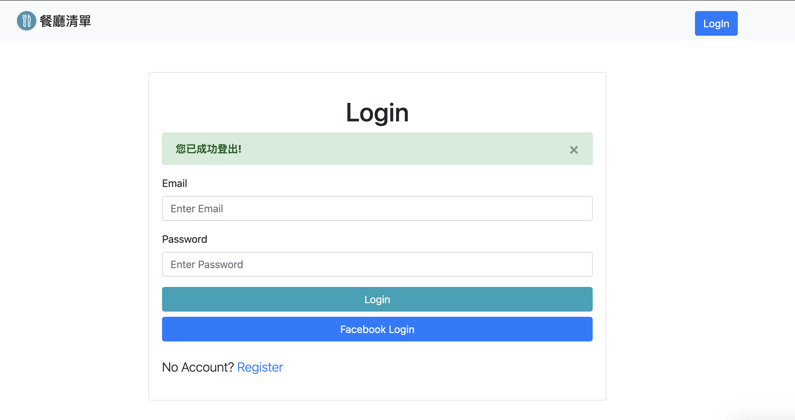
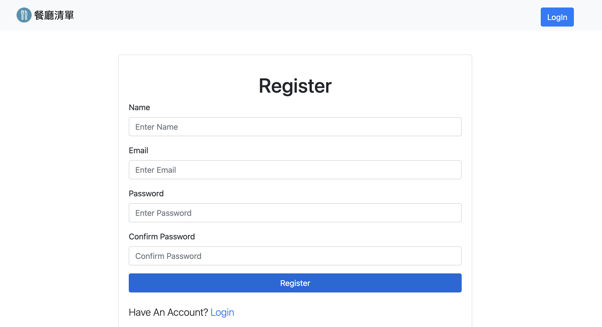

# favorite_restaurant





## 介紹

紀錄屬於自己的餐廳清單，可以瀏覽餐廳、查看詳細資訊、甚至連結到地圖。

### 功能
- 可利用email或FB帳號進行註冊
- 查看帳號內所有餐廳清單
- 可新增新的餐廳資料
- 可瀏覽、編輯餐廳的詳細資訊
- 點擊餐廳地址後的icon連結到 Google 地圖
- 可輸入餐廳名稱或類別關鍵字進行搜尋
- 可依餐廳名稱、類別、地區進行排序
- 可刪除不想保留的餐廳

## 開始使用

1. 請先確認有安裝 node.js 與 npm
2. 將專案 clone 到本地
3. 在本地開啟之後，透過終端機進入資料夾，輸入：

   ```bash
   npm install
   ```

4. 安裝完畢後，繼續輸入：

   ```bash
   npm run dev
   ```

5. 若看見此行訊息則代表順利運行，打開瀏覽器進入到以下網址

   ```bash
   Listening on http://localhost:3000
   ```

6. 新增種子資料

   ```bash
   npm run seed
   ```

## 開發工具

- bcryptjs 2.4.3
- body-parser 1.19.1
- Bootstrap 4.3.1
- connect-flash 0.1.1
- dotenv 16.0.0
- Express 4.17.2
- Express-Handlebars 3.0.0
- express-session 1.17.2
- Font-awesome 5.8.1
- method-override 3.0.0
- mongoose 6.1.7
- Node.js 14.16.0
- passport 0.5.2
- passport-facebook 3.0.0
- passport-local 1.0.0